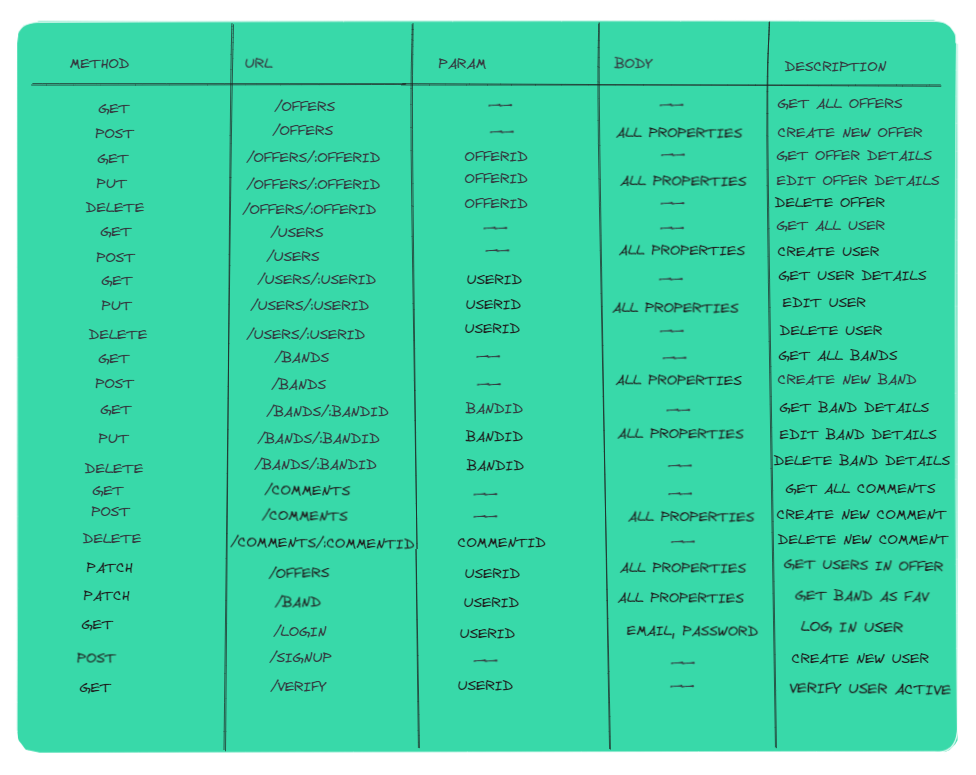

# INFO MUSIC JOB

## [INFO MUSIC JOB](https://infomusicjob.netlify.app/)

## Descripción

- Info Job Music, una web de búsqueda de trabajo en bandas y grupos musicales para aquellos artistas los cuáles quieren demostrar su talento a todos aquellos que asistan a los eventos musicales.

## Funcionalidad a Implementar

- Tengo que decir, que me gustaría haber podido implementar diferentes funcionales algunas que tenía pensadas como Bonus e incluso otras para la base de proyecto, pero por tiempo no ha sido posible. Algunas de ellas son:

- Que el admin de la banda pueda aceptar o rechazar a los candidatos a la oferta creada.

- Que una vez aceptado el admin tu solicitud de inscripción, apareciera tu nombre en los componentes del grupo.

- Implementar reseñas en los perfiles del usuario para mejorar la experiencia entre la comunidad, recomendando y valorando el arte y trabajo de los artistas.

- Más y mejores restricciones y validaciones mejoradas en los formularios.

## Tecnologías usadas

Las tecnologías usadas mayormente son: HTML, CSS, Javascript, Express, React, axios, React Context, Bootstrap.

## Estructura del Server

- User Model:
  {
  username: {type: String, required: [true, 'Name is required.'], unique: true,
  },
  email: {
  type: String,
  required: [true, 'Email is required.'],
  unique: true,
  lowercase: true,
  trim: true
  },
  password: {
  type: String,
  required: [true, 'Password is required.']
  },
  role: {
  type: String,
  enum: ["user", "admin"],
  default: "user",
  },
  genre: {
  type: [String],
  enum: musicGenre,
  },
  profileImg: {
  type: String,
  },
  dateborn: {
  type: Date,
  },
  city: {
  type: String,
  required: [true, 'City is required.']
  },
  offerType: {
  type: [String],
  enum: offerType,
  },
  bandFav: [
  {
  type: mongoose.Schema.Types.ObjectId,
  ref: "Band",
  },
  ],
  },

 

- Band Model:

    name: {
            type: String,
            required: [true, 'Name is required.'],
            unique: true,
        },
        components: {
        type: mongoose.Schema.Types.ObjectId,
        ref: "User",
        },
        genre: {
            type: [String],
            enum: musicGenre,
        },
        owner: {
            type: mongoose.Schema.Types.ObjectId,
            ref: "User",
        },
        city: {
        type: String,
        required: [true, 'City is required.'],
        },
        foundationDate: {
        type: Date,
        },

 

- Offer Model: 
    band: {
        type: mongoose.Schema.Types.ObjectId,
        ref: "Band",
        },
        title:{
        type: String,
        required: [true, 'Title is required.'],
        },
        description: {
        type: String,
        required: [true, 'Description is required.'],
        },
        genre: {
        type: [String],
        enum: musicGenre,
        },
        salary: {
        type: Number,
        required: [true, 'Salary is required']
        },
        offerType: {
            type: [String],
            enum: offerType
        },
        initialDate: {
        type: Date,
        },
        finalDate: {
            type: Date,
        },
        subscribers: [], 
 
- Comment Model: 
    owner: {
        type: mongoose.Schema.Types.ObjectId,
        ref: "User",
    },
    description: {
        type: String,
        required: [true, 'Description is required.'],
    },
    valoration: String,
    date: {
        type: Date,
    },

## Rutas Backend

Aquí muestro una imagen con mi planificación inicial de rutas, a lo largo del proyecto no he podido implementarlas todas como tenía pensado pero generalmente están todas mis rutas ahí. 

## Enlaces 

- [Developer Antonio Navas Barbado](https://github.com/antoniionavas)

## Proyecto

- [Enlace repositorio cliente](https://github.com/antoniionavas/my-app-client.git)

- [Enlace repositorio server](https://github.com/antoniionavas/my-app-server.git)

- [Enlace Deploy](https://infomusicjob.netlify.app/)

## Trello

- [Tablero Trello](https://trello.com/b/gf88plk2/tasks)

## Diapositivas

- [Presentación](https://docs.google.com/presentation/d/1Wr-2L-nNzwh1Incfqu3QBooMuO7z8otSsIlXscCGIzU/edit?usp=sharing)